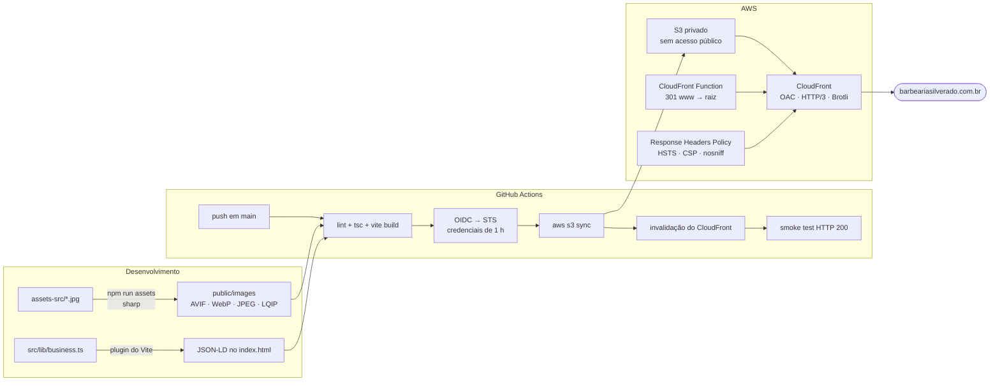

<div align="center">


<br>

**Landing page da [Barbearia Silverado](https://barbeariasilverado.com.br)** — Jardim América, Goiânia/GO

Um site de barbearia que carrega em menos de 1 s, custa quase nada por mês
e transforma uma visita em uma mensagem de WhatsApp já preenchida.

<br>

[](https://react.dev)
[](https://www.typescriptlang.org)
[](https://vite.dev)
[](https://tailwindcss.com)
[](https://gsap.com)
[](https://threejs.org)
[](https://aws.amazon.com)

</div>

---

## O problema

A barbearia tinha um Google Sites: nove fotos de corte, um endereço e um botão
de WhatsApp. Funcionava — e era exatamente igual ao de todas as outras
barbearias da cidade. O briefing foi curto: **parecer caro sem cobrar caro.**

E havia uma restrição dura: **custo operacional zero**. Nada de servidor, nada
de banco, nada de assinatura mensal de plataforma de agendamento. O que existe
aqui precisa caber no free tier e continuar funcionando sozinho.

---

## O que ficou diferente

### 🪒 Uma navalha de cromo em WebGL — sem baixar um único byte de terceiro

O herói do site é a navalha da marca em metal, girando devagar e acompanhando o
ponteiro. Metal cromado só existe se houver **algo para refletir**: sem
environment map, `metalness: 1` resulta num cinza chapado sem graça.

A solução usual é baixar um `.hdr` de estúdio (2–8 MB, hospedado num CDN de
terceiro). Aqui o ambiente é **montado em código**: quatro retângulos emissivos
posicionados como softboxes, cozidos uma única vez num cubemap pelo
`PMREMGenerator` do three.js.

```ts
// src/components/BladeScene.tsx
const SOFTBOXES = [
  { position: [0, 3.5, 4],    scale: [9, 3],    intensity: 5,   color: '#ffffff' }, // key
  { position: [-5, 1, -4],    scale: [6, 6],    intensity: 3.2, color: '#dbe4f0' }, // rim fria
  { position: [5, -1.5, 2],   scale: [5, 3],    intensity: 1.6, color: '#fff0dc' }, // kicker quente
  { position: [1.5, 4, -1],   scale: [0.35, 8], intensity: 7,   color: '#ffffff' }, // o "risco" do cromo
]
```

A lâmina e o cabo também são procedurais — `THREE.Shape` extrudado com bisel, em
vez de um `.glb`. **Zero asset externo, zero risco de CDN fora do ar,** e o
formato da navalha continua editável em código.

O `@react-three/drei` foi removido de propósito: resolveria ambiente, flutuação
e sombra de contato, mas traria junto os loaders de HDRI/gainmap que este site
nunca usa. Os três efeitos couberam em ~60 linhas.

### ⏱️ Agendamento que respeita o expediente — sem back-end

O agendador de quatro passos calcula, no navegador, os horários em que a
barbearia **poderia** atender: dois turnos por dia, almoço no meio, duração real
do serviço e uma hora de antecedência mínima.

```ts
// src/lib/booking.ts — um corte de 70 min não pode começar 19h40 se fecha às 20h
for (let t = start; t + service.minutes <= close; t += SLOT_STEP_MINUTES) {
  slots.push(fromMinutes(t))
}
```

O site **não finge** ter uma agenda em tempo real — ele não sabe o que já foi
vendido, e a interface diz isso na tela. O que ele faz é entregar ao WhatsApp
uma mensagem com serviço, dia, hora e nome já escritos, encurtando a conversa de
dez mensagens para uma.

Todo cálculo de horário roda no fuso de Goiânia, não no do visitante: quem abre
o site de Portugal precisa saber se a loja está aberta **lá**, não às 3 h da
manhã dele.

### 🎭 O logotipo virou máscara, não imagem

O logo original é um JPG cinza sobre fundo branco — inútil num site preto. O
pipeline de imagens extrai a silhueta por limiar de luminância e o componente
`<Logo>` usa esse PNG como `mask-image`, com o brilho cromado vindo de um
gradiente CSS.

Resultado: o reflexo virou código. Ele anima (`animate-sheen`), acompanha o
tema e fica nítido em qualquer densidade de tela.

### 🗺️ O Google Maps só é chamado se você pedir

O iframe do Maps custa centenas de kB de script de terceiro e um cookie de
rastreamento — em toda visita, mesmo de quem nunca olha o mapa. Aqui existe uma
**facade**: um bloco desenhado só com CSS e um botão. Quem quer o mapa clica;
quem só quer o endereço não paga por ele.

### 🔐 Deploy sem nenhum segredo guardado

Este repositório é público. Em vez de uma access key da AWS nos GitHub Secrets,
o deploy usa **OIDC**: a Action troca um token de curta duração emitido pelo
próprio GitHub por credenciais temporárias da AWS, com uma trust policy amarrada
a `repo:ffneiva/barbeariasilverado:ref:refs/heads/main`.

Não existe segredo permanente para vazar — nem em disco, nem em Secrets.

---

## Arquitetura



O S3 **não** é um bucket de website estático: ele é privado e só responde ao
CloudFront, autenticado por Origin Access Control. Não há URL pública de bucket
para alguém encontrar.

---

## Números

| Recurso                    | Transferido (Brotli) |
| -------------------------- | -------------------: |
| `index.html`               |              ~3,5 kB |
| CSS                        |              ~9,2 kB |
| JS de entrada              |               ~86 kB |
| GSAP                       |               ~44 kB |
| **Total do primeiro paint**|          **~143 kB** |
| Cena WebGL (three.js)      |  ~235 kB — sob demanda |

A cena 3D só é buscada quando a thread principal fica ociosa
(`requestIdleCallback`), depois que a página já está interativa — e **nunca** é
montada para quem tem `prefers-reduced-motion` ligado.

As fontes são auto-hospedadas (só os subsets `latin` e `latin-ext`, ~240 kB no
total), o que tira o Google Fonts do caminho crítico: menos uma conexão TLS a um
terceiro antes do primeiro texto pintar.

---

## Acessibilidade

Nada do que se mexe é necessário para usar o site.

- `prefers-reduced-motion` desliga **tudo**: preloader, scroll suave, cursor
  customizado, parallax, revelações e a cena 3D inteira.
- A galeria de cortes só sequestra o scroll no desktop. No celular vale a
  rolagem horizontal nativa com `snap` — sequestrar o gesto numa tela pequena
  confunde mais do que encanta.
- Cursor customizado só aparece em ponteiro fino, e o cursor do sistema nunca é
  removido de forma irreversível.
- Títulos animados são quebrados em palavras via JSX, não pelo `SplitText` — o
  texto continua sendo uma frase só para leitor de tela e para o Google.
- `<noscript>` com endereço, horário, preços e telefone, para o caso de o JS
  falhar.

---

## SEO

O JSON-LD é gerado **em tempo de build** a partir de `src/lib/business.ts`, a
mesma fonte que alimenta a página. Preço, horário e endereço não podem divergir
entre o que o visitante lê e o que o Google indexa.

```ts
// vite.config.ts
function jsonLdPlugin(): Plugin {
  return {
    name: 'silverado-jsonld',
    transformIndexHtml: () => [{
      tag: 'script',
      attrs: { type: 'application/ld+json' },
      children: JSON.stringify(buildJsonLd()),
      injectTo: 'head',
    }],
  }
}
```

O `@graph` publica `HairSalon` (com `openingHoursSpecification` dos dois turnos,
`geo`, `priceRange` e `hasOfferCatalog`), `WebSite`, `FAQPage` e `ImageGallery`.

---

## O que é testado

Layout quebrado aparece na tela. Horário errado, não — ele manda o cliente para
uma barbearia fechada. Então a única lógica de negócio do site tem asserções
próprias, rodando no CI antes de qualquer deploy:

```
$ npm run check

── hours.ts ─────────────────────────────────────────────
  ok   seg 12h30 — volta do almoço
  ok   sábado 18h — aberto até 19h
  ok   vira-noite respeita o fuso da loja
── booking.ts ───────────────────────────────────────────
  ok   hoje/corte — respeita 1h de antecedência
  ok   hoje/combo 70min — não cabe na manhã
  ok   domingo — nenhum horário
…
✅ Toda a lógica passou.
```

As datas dos casos são fixas e em UTC — Goiânia é UTC−3 o ano inteiro desde o
fim do horário de verão, então os testes valem em qualquer máquina, em qualquer
fuso. Sem framework de teste e sem dependência nova: o Node 22 remove os tipos
do TypeScript sozinho.

O segundo teste sobe o **servidor de desenvolvimento de verdade** e percorre o
grafo de módulos a partir da entrada. Ele existe porque `vite build` e
`vite dev` resolvem imports por caminhos diferentes: já aconteceu de o build
passar e o `npm run dev` quebrar no primeiro import — um erro que nenhuma das
outras verificações via.

---

## Estrutura

```
├── assets-src/            fotos originais (entram no pipeline do sharp)
├── public/
│   ├── fonts/             woff2 auto-hospedados, subsets latin
│   └── images/            AVIF + WebP + JPEG gerados
├── scripts/
│   ├── optimize-images.mjs   assets-src → public/images + manifest com LQIP
│   ├── generate-og.mjs       cartão social, favicons, manifest, robots, sitemap
│   ├── fetch-fonts.mjs       baixa os subsets do Google Fonts
│   ├── aws-setup.sh          provisiona toda a infraestrutura (idempotente)
│   └── aws-attach-domain.sh  anexa o domínio quando o certificado sai
└── src/
    ├── lib/
    │   ├── business.ts       ← fonte única de verdade do conteúdo
    │   ├── hours.ts          aberto agora?, no fuso da barbearia
    │   ├── booking.ts        grade de horários e mensagem do WhatsApp
    │   └── seo.ts            JSON-LD
    ├── components/           Logo, Cursor, Preloader, BladeScene, Nav…
    ├── sections/             Hero, Manifesto, Serviços, Cortes, Agendar…
    └── pages/Privacy.tsx
```

Preço, horário, serviço e texto vivem todos em **`src/lib/business.ts`**.
Mudar um preço é editar uma linha e dar `git push` — o deploy é automático.

---

## Rodando localmente

```bash
npm install
npm run dev          # http://localhost:5173
```

| Comando              | O que faz                                                        |
| -------------------- | ---------------------------------------------------------------- |
| `npm run dev`        | servidor de desenvolvimento com HMR                              |
| `npm run build`      | type-check + build de produção em `dist/`                        |
| `npm run preview`    | serve o `dist/` localmente                                       |
| `npm run lint`       | ESLint                                                           |
| `npm run check`      | 37 asserções sobre horário e grade de agendamento                |
| `npm run check:dev`  | sobe o dev server e percorre o grafo de módulos                   |
| `npm run assets`     | regenera `public/images` a partir de `assets-src`                |
| `npm run og`         | regenera cartão social, favicons, manifest, robots e sitemap     |

Os scripts de asset rodam **localmente** e o resultado é versionado: o CI fica
sendo só `vite build`, sem o `sharp` (dependência binária, lenta em runner frio).

---

## Deploy

`git push` na `main` → GitHub Actions → S3 → invalidação do CloudFront →
smoke test. O passo a passo completo, incluindo o provisionamento inicial e o
DNS, está em **[DEPLOY.md](DEPLOY.md)**.

---

## Custo

| Serviço      | Uso                        | Custo/mês |
| ------------ | -------------------------- | --------: |
| S3           | ~8 MB armazenados          |   ~R$ 0,00 |
| CloudFront   | dentro do free tier perpétuo (1 TB / 10 M req.) |   R$ 0,00 |
| ACM          | certificado TLS            |   R$ 0,00 |
| GitHub Actions | repositório público      |   R$ 0,00 |
| **Total**    |                            | **~R$ 0** |

O único custo real do projeto é o registro do domínio `.com.br`.

---

<div align="center">

**Barbearia Silverado** · Avenida C-4, nº 73 — Jardim América, Goiânia/GO
[WhatsApp](https://wa.me/5562998575858) · [@barbeariasilverado](https://instagram.com/barbeariasilverado)

<sub>Desenvolvido por <a href="https://github.com/ffneiva">@ffneiva</a>. Código sob licença MIT;<br>
marca, fotografias e conteúdo são propriedade da Barbearia Silverado.</sub>

</div>
